# Workout-App

Personal Workout-App is mainly made for my own purposes.
All data is saved locally using Room library, so there's no need for internet connection.

## Features

- **Daily/Previous Nutrients**: Easily calculate and monitor essential nutrients like calories, proteins, carbs, and fats, with the ability to track daily intake for each day. Add, track, preview and calculate current intakes during the day.

- **Personal Data**: Monitor your personal records in weightlifting exercises such as bench press, deadlift, and squad. Monitor you current weight, and last update date.

- **Trainings**: Simple Track of your training/workout plan. Add/Update/Delete workout for any day in the week.

- **Meals**: Create/Read/Update/Delete ingredients and macros for every meals.

## Description

A Personal app whose main goal is to track daily calorie intake and other nutrients. In addition, it's necessary to monitor the current body weight and the personal records in strength exercises.

### User interface

Pics of the app's user interface:

Click for images

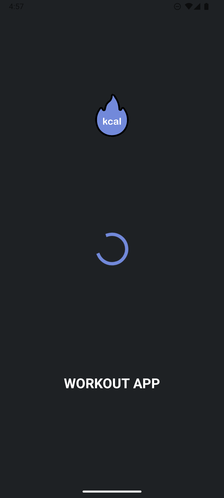
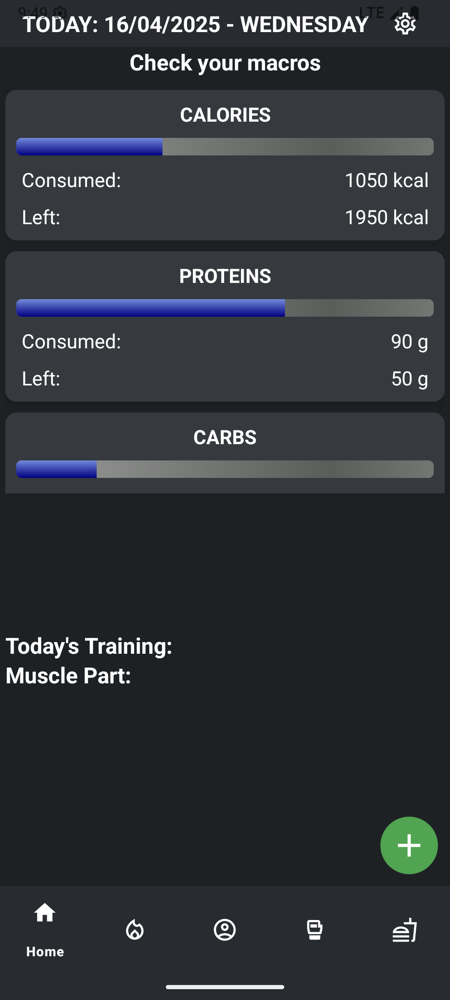
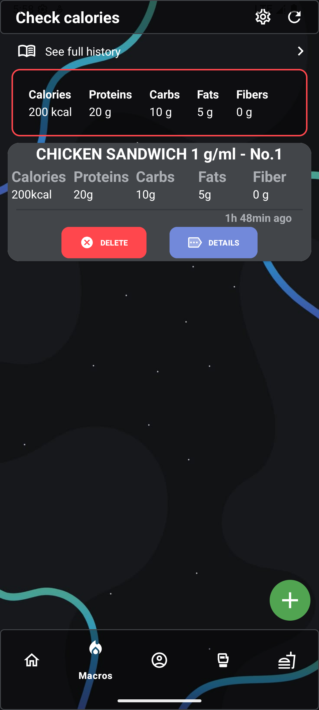
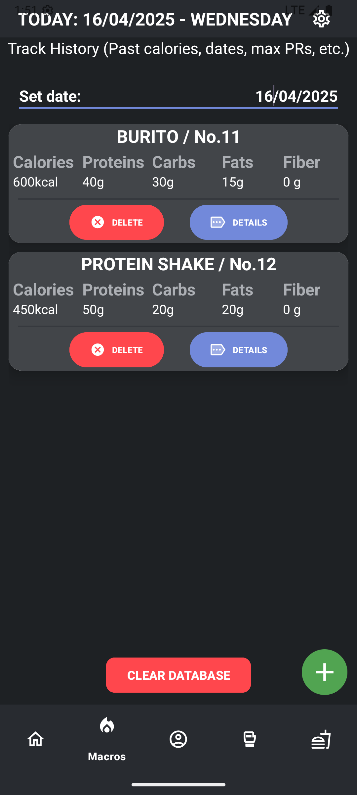
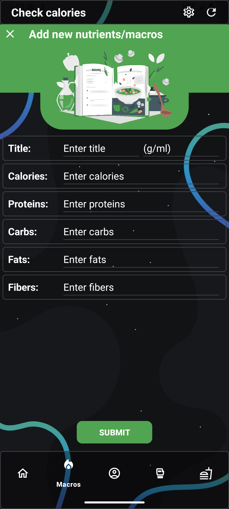
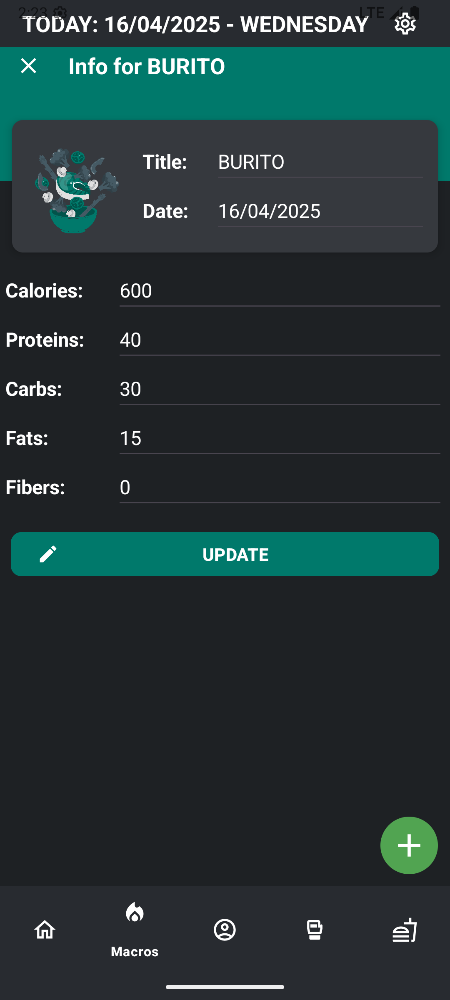
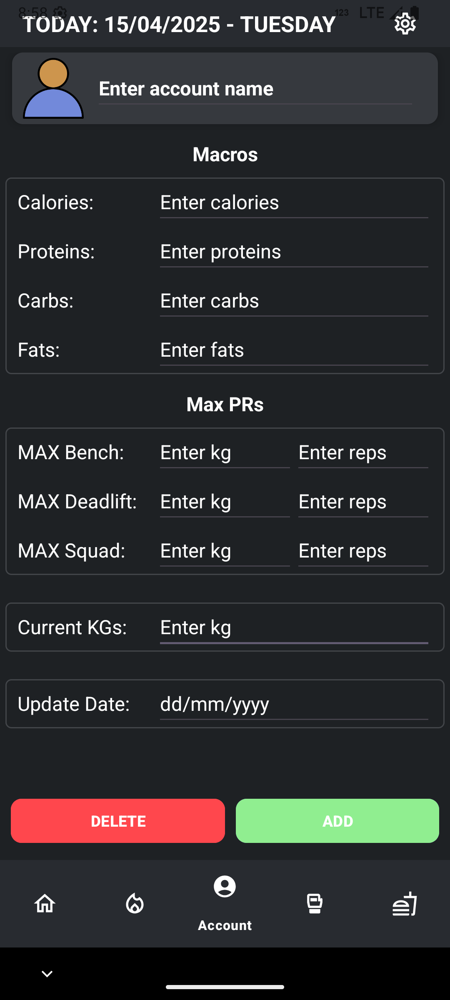
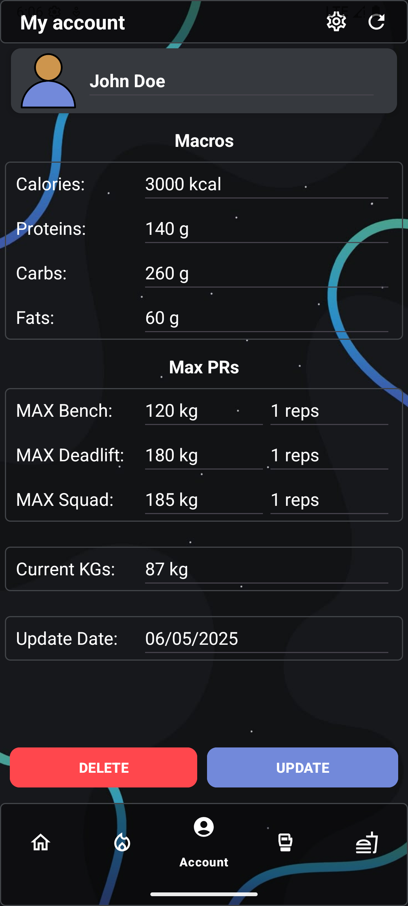
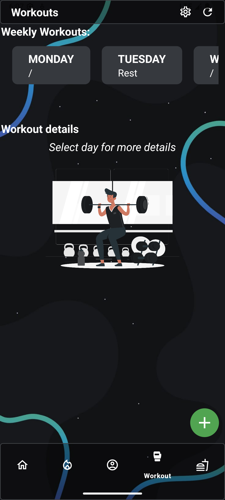
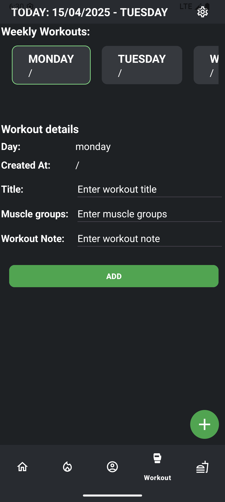
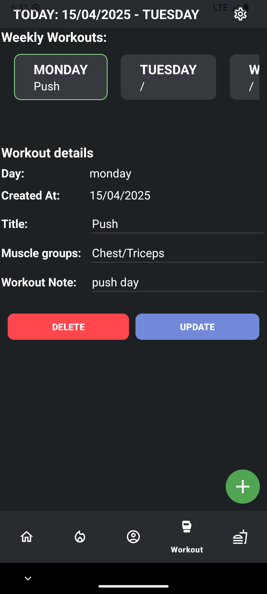
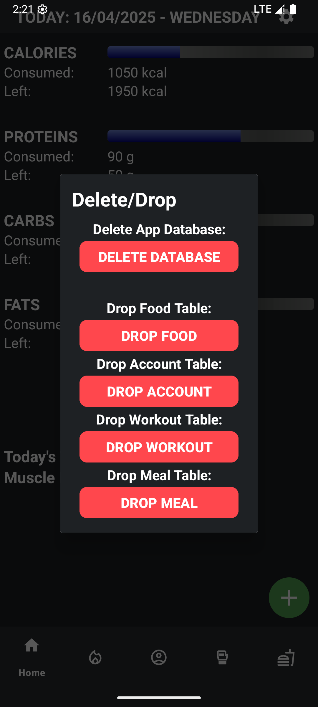
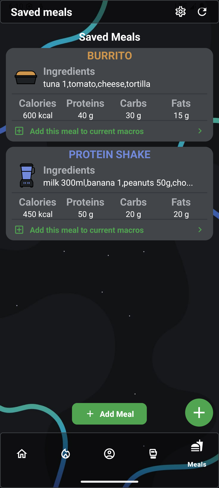
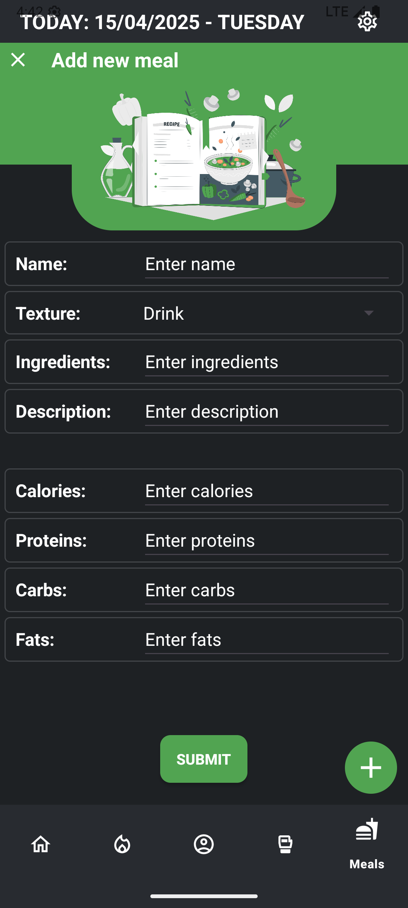
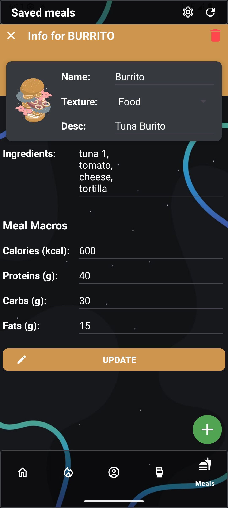
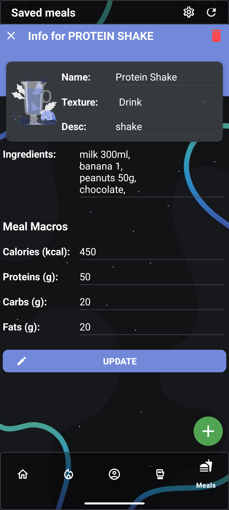

### Tables

- account_data (_only 1 instance_)
- food_data
- workout_data
- meals_data

Account table

| id | name     | calories | proteins | carbs | fats | max_bench_kg | max_bench_reps | max_deadlift_kg | max_deadlift_reps | max_squad_kg | max_squad_reps | current_weight | account_date |
|----|----------|----------|----------|-------|------|--------------|----------------|-----------------|-------------------|--------------|----------------|----------------|--------------|
| 1  | John Doe | 3000     | 150      | 300   | 80   | 90           | 2              | 120             | 4                 | 150          | 5              | 85             | 26/03/2025   |

Food table

| number | title     | calories | proteins | carbs | fats | date        | time   |
|--------|-----------|----------|----------|-------|------|-------------|--------|
| 56     | Milk 300  | 150      | 15       | 5     | 8    | 26/03/2025  | 16:30  |
| 57     | Bread 200 | 250      | 10       | 50    | 4    | 26/03/2025  | 16:30  |

Workout table

| number | day             | muscle           | workout_title | createdAt   | note         |
|--------|-----------------|------------------|---------------|-------------|--------------|
| 1      | monday          | chest/triceps    | push          | 30/03/2025  | Prsonedeljak |
| 2      | tuesday         | /                | rest          | 30/03/2025  | /            |
| 3      | saturday/sunday | swimming/running | condition     | 20/03/2025  | Svimosreda   |

Meals table

| number | name         | texture | ingredients                 | description |
|--------|--------------|---------|-----------------------------|-------------|
| 1      | Simple Shake | drink   | milk, banana, peanut, honey | shake       |

 

Workout-App is mainly made for myself, and there are still many things that can be improved and added.
 
The application is made with the aim of being as light and simple as possible, not to look good.
